# Lab 2 dan Lab 3
Nama    : Febriyani Nurhida

NIM     : 312210222

Kelas   : TI.22.A.2

# KONDISI DAN PERULANGAN

## Lab 2 : Struktur Kondisi

### Latihan 1

• Buat program sederhada dengan input 2 buah bilangan, kemudian tentukan bilangan terbesar dari kedua bilangan tersebut menggunakan statement if!

langkah-langkah :

pertama  siapkan 2 buah variabel, yaitu x dan y.

``` python
x = int(input("Masukkan bilangan ke 1: "))
y = int(input("Masukkan bilangan ke 2: "))
```


langkah selanjutnya adalah menulis logika untuk mencari angka terbesar, apakah itu x? atau y?

Berikut ini kira-kira implementasi logikanya:

``` python
if x > y:
    print("Bilangan ke 1 adalah yang terbesar : %s "%x)
else:
    print("Bilangan ke 2 adalah yang terbesar : %s "%y)
```


berikut ketika kode diatas saya tuliskan di pycharm :

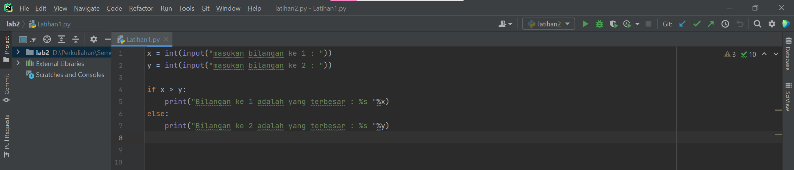


langkah terakhir yaitu testing, saya coba masukkan angka 3 dan 5:

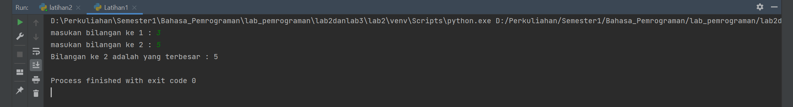

Kelemahan dari kode di atas adalah, jika kita masukkan 2 angka yang sama, maka nilai y lah yang dianggap terbesar. Kita bisa memodifikasi sendiri agar kalau angkanya sama, output yang ditampilkan adalah “Kedua angka sama”, atau yang semisalnya.

### Latihan 2

• Buat program untuk mengurutkan data berdasarkan input sejumlah data (minimal 3 variable input atau lebih), kemudian tampilkan hasilnya secara berurutan mulai dari data terkecil.


Data yang sebelumnya bersifat acak, namun kemudian diurutkan dari nilai terkecil ke terbesar.Bahasa pemrograman python menyediakan fungsi built-in untuk mengurutkan data yang ada di dalam array list python.

Fungsi tersebut adalah fungsi sort().

``` short() ```

berikut implementasi logikanya : 

``` python
angka = []
for i in range(5) :
    a = int(input("Masukan Bilangan :"))
    angka.append(a)
print("Angka Sebelum diurutkan :", angka)
list.sort(angka)
print("Angka setelah diurutkan :", angka)
```

Pada program diatas, misi kita adalah mengurutkan data yang ada pada array list variabel luas dari urutan acak menjadi urruan dari nilai terkecil ke terbesar.
Untuk itu kita bisa gunakan fungsi sort(), dengan menggunakan kode program luas.sort(). Tidak perlu ada parameter yang kita tulis dalam fungsi sort(). 
Untuk lebih jelasnya bisa dilihat pada  program python sederhana di bawah ini.

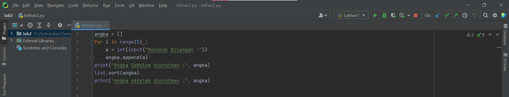

Setelah itu kita ingin buktikan, kita coba tampilkan hasil dari pengurutan tersebut menggunakan fungsi print().
Setelah ditampilkan kita bisa lihat bahwa data di dalam array list python kini sudah terurut dari nilai terkecil ke nilai terbesar.

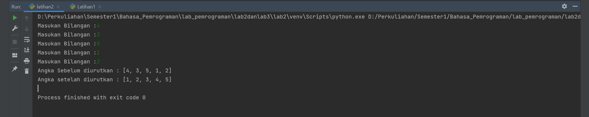


## Lab 3 : Perulangan

### Latihan 1

• Buat program dengan perulangan bertingkat (nested) for yang menghasilkan output sebagai berikut:

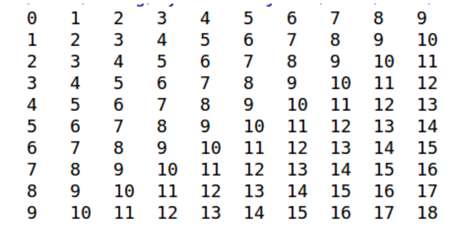

Dari soal diats kita dapat memahami bahwa dalam pembuatan program diatas, kita perlu memnbuat dua pernyataan for yang bertingkat. Fungsi for yang tertinggi atau yang terluar kita tempatkan untuk mengatur banyaknya baris yang akan kita buat dengan batasan yaitu seanyak n kali. Dan pada pernyataan for yang berikutnya, kita gunakan untuk membuat barisan angka yang berjejer mulai dari 1 hingga batasan ke-n.

``` python
for i in range(0,10):
    print()
    print(i, end="\t")
    for j in range(1,10):
        print(i+j,end="\t")
```

kita dapat membuatkan program diatas sebagai berikut.

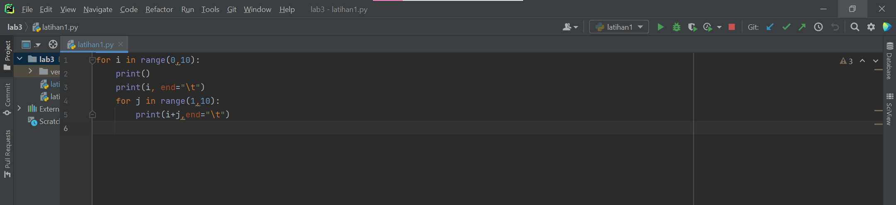

range(0,10) artinya melakukan perulangan antara 0 sampai 10(0 dan 10 tidak termasuk.


Program yang telah kita buat seperti pada gambar diatas jika kita coba untuk running amaka akan diperoleh hasil sebagai berikut :

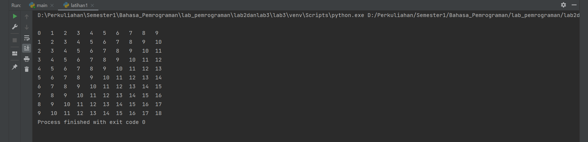


### Latihan 2

• Tampilkan n bilangan acak yang lebih kecil dari 0.5.
• nilai n diisi pada saat runtime
• anda bisa menggunakan kombinasi while dan for untuk menyelesaikannya

berikut langkah-langkah untuk menampilkan bilangan acak yang lebih kecil dari 0.5

1.Mulai

2.Tampilkan n bilangan acak yang lebih kecil dari 0.5

3.Nilai n diisi pada saat runtime

4.Anda bisa menggunakan kombinasi while dan for untuk menyelesaikannya.

5.Gunakan fungsi random() yang dapat diimport terlebih dahulu.

6.Selesai


berikut penjelasan dari program diatas :

``` python
from random import random

n = int(input("Masukan Beberapa perulangan : "))
while n==n:
    break
for i in range(n):
    bil = random()%0.5
    print("Perulangan ke : ", bil)
```

"print" : berfungsi untuk mencetak atau menampilkan objek ke perangkat keluaran (layar) atau ke file teks.

"import" : fungsi lanjut yang dipanggil oleh statement import.

"random" : untuk menentukan suatu pilihan.

"range" : merupakan fungsi yang menghasilkan list. Fungsi ini akan menciptakan sebuah list baru dengan rentang nilai tertentu.

"uniform": digunakan untuk menampilkan bilangan float random dengan batas awal bilangan x, dan batas akhir bilangan y.

berikut hasil program setelah di run :

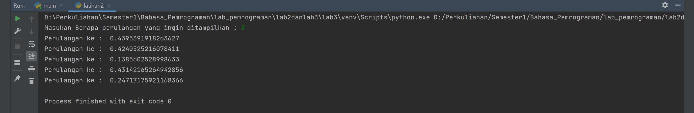


## Modul Praktikum 2 dan Praktikum 3

## Labspy02 dan Labspy03
## Labspy02
### Mencari Angka Terbesar Dari 3 Angka

berikut saya tampilkan flowchart dari program mencari angka terbesar


### Persiapan Variabel

kita mulai langsung dengan menyiapkan 3 buah variabel, yaitu a, b, dan c.
Ketiga variabel ini kita isi dari inputan user seperti berikut:

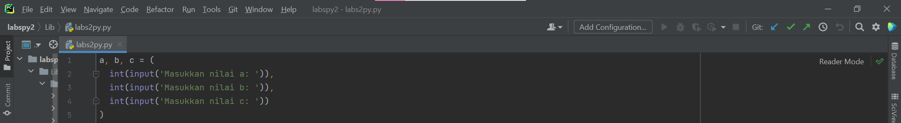


### Mencari Angka Terbesar Antara a, b, dan c

Langkah selanjutnya adalah menulis logika untuk mencari angka terbesar, apakah itu a? b? atau c?
Berikut ini kira-kira implementasi logikanya:

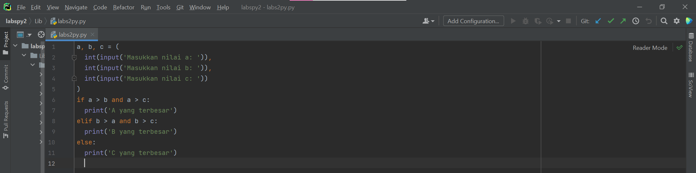

Sekarang coba kita testing, saya coba masukkan angka 6, 4, dan 8:

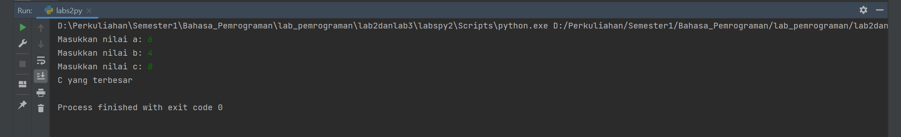

berikut saya tampilkan screenshot seluruh layar dari program

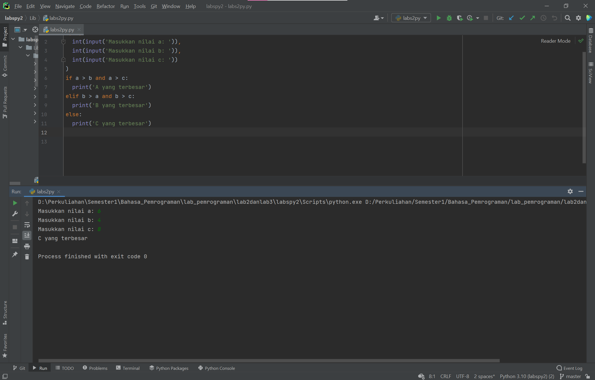


## labpy03
### latihan 1 :
#### Flowchart latihan1

dibawah ini saya tampilkan flowchart dari latihan 1 :


#### Algoritma latihan1 :

Menampilkan n bilangan acak yang lebih kecil dari 0,5, nilai n diisi 
pada saat runtime.

1.Memasukan/ import fungsi RANDOM terlebih dahulu

2.Deklarasi integer , masukkan jumlah n :

3.Memasukan deskripsi kombinasi for untuk menyelesaikannya.

4.Memasukan nilai jumlah (n) : 5

5.Mencetak data ke 1 sampai 5 dengan hasil nilai kurang dari 0,5.

6.Selesai

#### Syntax latihan 1 sebagai berikut :

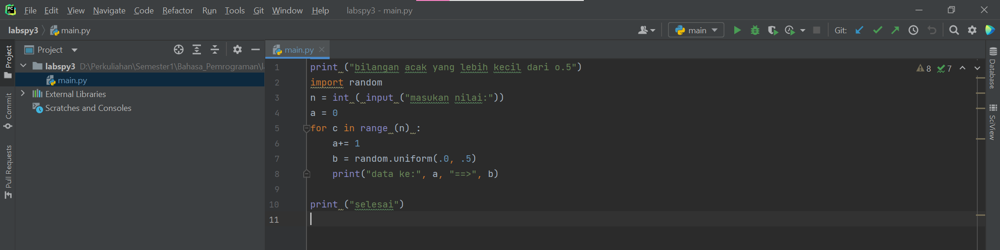

#### Hasil out put latihan 1 sebagai berikut :

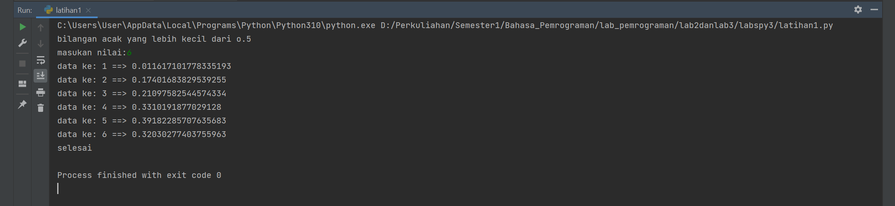

### latihan 2 :
#### Flowchart latihan 2

dibawah ini saya tampilkan flowchart dari latihan 2 :


#### Algoritma latihan 2:

Membuat program untuk menampilkan bilangan terbesar dari n buah data 
yang diinputkan.Masukkan angka 0 untuk berhenti

1.Mulai

2.Mencetak "latihan 2"

3.Mencetak "menampilkan bilangan, berhenti ketika bilangan 0, 
menampilkan bilangan terbesar"

4.integer max = 0 

5.Menggunakan fungsi perulangan while true, hingga menampilkan 
perulangan sampai batas tertentu. 

6.Memasukan bilangan integer pada "a"

7.Menggunakan fungsi if jika max kurang dari nilai a, maka max sama 
dengan a 

8.Mengunakan fungsi if jika nilai a adalah 0 maka fungsi break artinya 
perulangan berhenti jika menulis nilai 0.

9.Mencetak nilai paling terbesarv setelah break, sehingga menampilkan 
nilai terbesar diantara bilangan tersebut dalam perulangan.

10.Selesai

#### Syntax latihan 2 sebagai berikut :


#### Hasil out put latihan 2 ketika di runtime sebagai berikut :

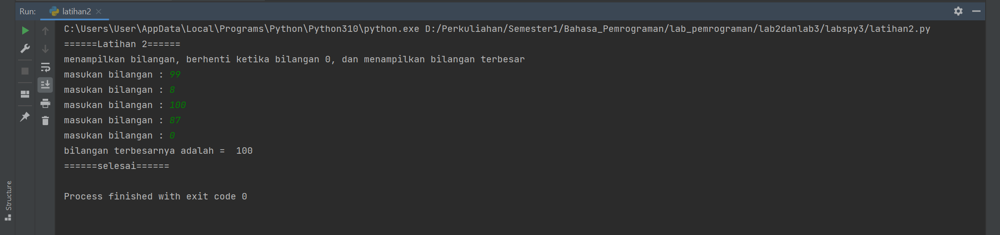


### program 1 :
#### Flowchart pemrograman 1


#### ALGORITMA menghitung keuntungan selama 8 bulan berjalannya usaha.

1.Mulai

2.Mencetak latihan1

3.Mencetak "Program menghitung laba dengan modal awal 100 juta"

4.Membuat Note 

5.Mencetak Bulan pertama dan kedua = 0%

6.Mencetak bulan ke 3 = 1%

7.Mencetak bulan ke 5 = 5%

8.Mencetak bulan ke 8 = 2%

9.integer a = 100.000.000( modal awal)

10.Menggunakan fungsi looping for pada nilai x 1-9 untuk menampilkan 
bulan 1 sampai 
bulan 8.

11.Menggunakan fungsi if, untuk menghitung laba bulan 1 sampai 8

12.bulan pertama dan kedua laba adalah 0

13.bulan ke 3 dan ke 4 mendapat laba 1% sehingga modal di kali 1% = 
keuntungan

14.bulan ke 5 mendapatkan laba 5%, sehingga modal dikali 5% = keuntungan 

15.Bulan ke 8 mmendapatkan laba 2% sehingga keuntungan menurun dari 
bulan sebelumnya, 
modal dikali 2% = keuntungan.

16.Menghitung jumlah total laba dengan menjumlah keuntungan dari bulan 
ke 1 sampai 
bulan 8, hasilnya adalah total keuntungan yang didapat.

17.Selesai


#### Syntax program1 sebagai berikut :

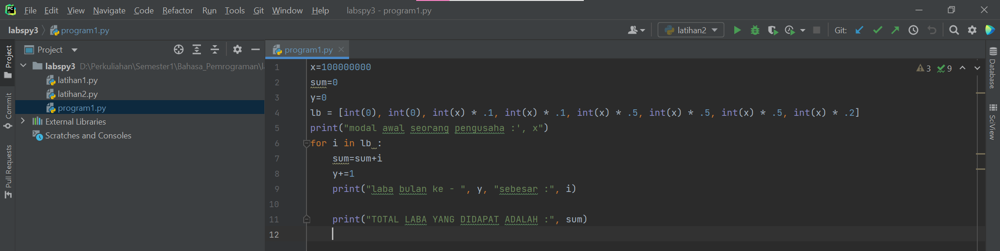

#### Hasil out put program1 ketika runtime adalah sebagai berikut :

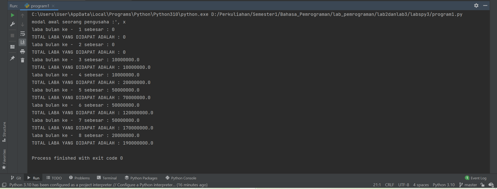

sekian penjelasan dari saya, terima kasih :)

#### Author : Febriyani Nurhida