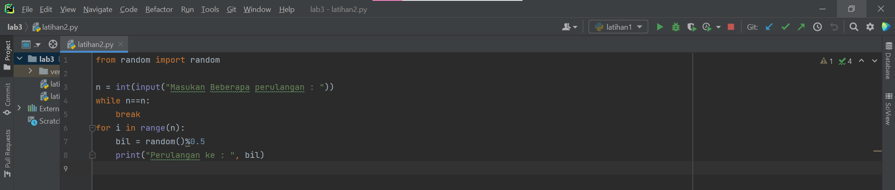

# Lab 2 dan Lab 3
Nama    : Febriyani Nurhida
NIM     : 312210222
Kelas   : TI.22.A.2

# KONDISI DAN PERULANGAN

## Lab 2 : Struktur Kondisi

### Latihan 1

• Buat program sederhada dengan input 2 buah bilangan, kemudian tentukan bilangan terbesar dari kedua bilangan tersebut menggunakan statement if!

langkah-langkah :

pertama  siapkan 2 buah variabel, yaitu x dan y.

``` python
x = int(input("Masukkan bilangan ke 1: "))
y = int(input("Masukkan bilangan ke 2: "))
```


langkah selanjutnya adalah menulis logika untuk mencari angka terbesar, apakah itu x? atau y?

Berikut ini kira-kira implementasi logikanya:

``` python
if x > y:
    print("Bilangan ke 1 adalah yang terbesar : %s "%x)
else:
    print("Bilangan ke 2 adalah yang terbesar : %s "%y)
```


berikut ketika kode diatas saya tuliskan di pycharm :


langkah terakhir yaitu testing, saya coba masukkan angka 3 dan 5:


Kelemahan dari kode di atas adalah, jika kita masukkan 2 angka yang sama, maka nilai y lah yang dianggap terbesar. Kita bisa memodifikasi sendiri agar kalau angkanya sama, output yang ditampilkan adalah “Kedua angka sama”, atau yang semisalnya.

### Latihan 2

• Buat program untuk mengurutkan data berdasarkan input sejumlah data (minimal 3 variable input atau lebih), kemudian tampilkan hasilnya secara berurutan mulai dari data terkecil.


Data yang sebelumnya bersifat acak, namun kemudian diurutkan dari nilai terkecil ke terbesar.Bahasa pemrograman python menyediakan fungsi built-in untuk mengurutkan data yang ada di dalam array list python.

Fungsi tersebut adalah fungsi sort().

``` short() ```

berikut implementasi logikanya : 

``` python
angka = []
for i in range(5) :
    a = int(input("Masukan Bilangan :"))
    angka.append(a)
print("Angka Sebelum diurutkan :", angka)
list.sort(angka)
print("Angka setelah diurutkan :", angka)
```

Pada program diatas, misi kita adalah mengurutkan data yang ada pada array list variabel luas dari urutan acak menjadi urruan dari nilai terkecil ke terbesar.
Untuk itu kita bisa gunakan fungsi sort(), dengan menggunakan kode program luas.sort(). Tidak perlu ada parameter yang kita tulis dalam fungsi sort(). 
Untuk lebih jelasnya bisa dilihat pada  program python sederhana di bawah ini.


Setelah itu kita ingin buktikan, kita coba tampilkan hasil dari pengurutan tersebut menggunakan fungsi print().
Setelah ditampilkan kita bisa lihat bahwa data di dalam array list python kini sudah terurut dari nilai terkecil ke nilai terbesar.


## Lab 3 : Perulangan

### Latihan 1

• Buat program dengan perulangan bertingkat (nested) for yang menghasilkan output sebagai berikut:


Dari soal diats kita dapat memahami bahwa dalam pembuatan program diatas, kita perlu memnbuat dua pernyataan for yang bertingkat. Fungsi for yang tertinggi atau yang terluar kita tempatkan untuk mengatur banyaknya baris yang akan kita buat dengan batasan yaitu seanyak n kali. Dan pada pernyataan for yang berikutnya, kita gunakan untuk membuat barisan angka yang berjejer mulai dari 1 hingga batasan ke-n.

``` python
for i in range(0,10):
    print()
    print(i, end="\t")
    for j in range(1,10):
        print(i+j,end="\t")
```

kita dapat membuatkan program diatas sebagai berikut.


range(0,10) artinya melakukan perulangan antara 0 sampai 10(0 dan 10 tidak termasuk.


Program yang telah kita buat seperti pada gambar diatas jika kita coba untuk running amaka akan diperoleh hasil sebagai berikut :


### Latihan 2

• Tampilkan n bilangan acak yang lebih kecil dari 0.5.
• nilai n diisi pada saat runtime
• anda bisa menggunakan kombinasi while dan for untuk menyelesaikannya

berikut langkah-langkah untuk menampilkan bilangan acak yang lebih kecil dari 0.5

1.Mulai

2.Tampilkan n bilangan acak yang lebih kecil dari 0.5

3.Nilai n diisi pada saat runtime

4.Anda bisa menggunakan kombinasi while dan for untuk menyelesaikannya.

5.Gunakan fungsi random() yang dapat diimport terlebih dahulu.

6.Selesai



berikut penjelasan dari program diatas :

``` python
from random import random

n = int(input("Masukan Beberapa perulangan : "))
while n==n:
    break
for i in range(n):
    bil = random()%0.5
    print("Perulangan ke : ", bil)
```

"print" : berfungsi untuk mencetak atau menampilkan objek ke perangkat keluaran (layar) atau ke file teks.

"import" : fungsi lanjut yang dipanggil oleh statement import.

"random" : untuk menentukan suatu pilihan.

"range" : merupakan fungsi yang menghasilkan list. Fungsi ini akan menciptakan sebuah list baru dengan rentang nilai tertentu.

"uniform": digunakan untuk menampilkan bilangan float random dengan batas awal bilangan x, dan batas akhir bilangan y.

berikut hasil program setelah di run :


sekian penjelasan dari saya, terima kasih :)

#### Author : Febriyani Nurhida